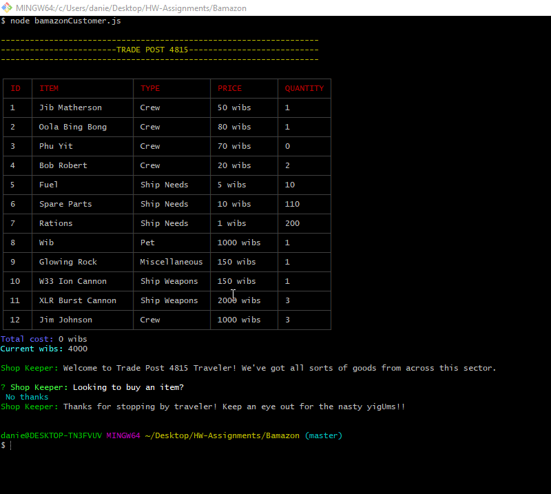

# Bamazon

## Site Gif

## Technologies Used
* [Visual Studio Code](https://code.visualstudio.com) - source code editor
* [Node](https://nodejs.org/en/) - a run-time environment that executes Javascript code outside the browser
* [MYSQL](https://www.mysql.com/) - an open-source relational database management system.

## Node Packages
* [Inquirer](https://www.npmjs.com/package/inquirer) - prompts to allow user to pick from list or input a value
* [MYSQL](https://www.npmjs.com/package/mysql) - used to access MYSQL database to retrieve and modify data
* [Ansi-Colors](https://www.npmjs.com/package/ansi-colors) - used to give colors to the console 
* [cli-table](https://www.npmjs.com/package/cli-table) - used to show table representation of data

## Summary
In this application, I created a data management system where a user could trade from a Trade Post for items at a certain price. I used MYSQL to create a database that had tables where I could input data that the user could see and modify by purchasing. I also allowed the addition of new items in the table products if the user decides to be a manager. It was essential to use MYSQL and Inquirer in conjunction with each other to take in requests for MYSQL's use.

The essentials for this app were:
- Using MYSQL to have a database for the user to interact with
- Using the MYSQL npm package to make requests of data from a table or to modify data within a table.
- Using the inquirer npm package to allow the user to make multiple querys to be used by the MYSQL npm package.

## My links

- [Github](https://github.com/dchicchon)
- [LinkedIn](https://www.linkedin.com/in/danielchicchon/)